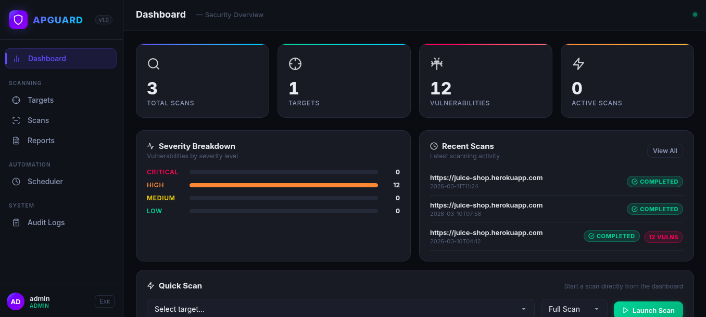

# Web Application Security Scanner

> A professional desktop + web vulnerability scanner built with Go, Wails v2, SQLite, and Vanilla JS.
> Detects SQL Injection, Cross-Site Scripting, Local File Inclusion, and Misconfigurations.

---
> Samples images 
1. 

## Table of Contents

1. [Overview](#overview)
2. [Features](#features)
3. [Prerequisites](#prerequisites)
4. [Installation](#installation)
5. [Running the App](#running-the-app)
6. [How It Works](#how-it-works)
7. [Architecture](#architecture)
8. [Database Schema](#database-schema)
9. [Scanning Engine](#scanning-engine)
10. [Security Model](#security-model)
11. [Project File Tree](#project-file-tree)
12. [Development Guide](#development-guide)
13. [Default Credentials](#default-credentials)
14. [Data Location](#data-location)
15. [Legal Notice](#legal-notice)

---

## Overview

APGUARD is a self-contained web application vulnerability scanner that runs as either:

- **Desktop app** — via [Wails v2](https://wails.io) (native window, no browser required)
- **Web server** — via the standalone HTTP server (`cmd/server`), accessible at `http://localhost:9272`

Both modes share the same Go backend, SQLite database, and Vanilla JS single-page frontend.

---

## Features

| Feature | Description |
|---|---|
| **SQLi Detection** | Error-based SQL injection across MySQL, MSSQL, PostgreSQL, Oracle, JDBC |
| **XSS Detection** | Reflected XSS via tag injection and DOM pattern matching |
| **LFI Detection** | Local File Inclusion via `/etc/passwd` and Windows system file patterns |
| **Misconfiguration** | Directory listing enabled, server version disclosure |
| **Target Management** | CRUD for web app targets with enable/disable control |
| **Concurrent Scanning** | Goroutine-per-parameter scanning for speed |
| **Scan Profiles** | Full (SQLi+XSS+LFI+Misconfig) or Quick (SQLi+XSS only) |
| **Scheduled Scans** | Cron-based automated scanning (`@hourly`, `@daily`, `@weekly`, `@monthly`) |
| **Reports** | Structured vulnerability reports with risk scoring |
| **CSV Export** | Downloadable vulnerability data as CSV |
| **PDF Export** | Print-quality A4 PDF via browser print dialog |
| **Audit Logs** | Full user action trail (login, scan start, target changes) |
| **JWT Auth** | bcrypt password hashing + JWT session management |
| **Session Persistence** | Desktop app remembers login across restarts |

---

## Prerequisites

### Required

| Tool | Version | Install |
|---|---|---|
| **Go** | 1.21+ | [go.dev/dl](https://go.dev/dl/) |
| **Node.js** | 18+ | [nodejs.org](https://nodejs.org/) |
| **gcc / build-essential** | Any | `sudo apt install build-essential` |
| **SQLite3 dev libs** | Any | `sudo apt install libsqlite3-dev` |

### For Desktop App (Wails) — Optional

The Wails desktop mode requires GTK3/WebKit2GTK. On Kali/Debian/Ubuntu:

```bash
sudo apt install -y \
  libgtk-3-dev \
  libwebkit2gtk-4.0-dev \
  pkg-config
```

> **Note:** If GTK3 is not available, use the standalone **HTTP server mode** instead — it works the same way through any browser.

---

## Installation

### 1. Clone the repository

```bash
git clone https://github.com/jomboi8/apguard.git
cd apguard
```

### 2. Install Go dependencies

```bash
go mod download
```

### 3. Build the frontend

```bash
cd frontend
npm install
npm run build
cd ..
```

### 4. (Optional) Install the Wails CLI for desktop mode

```bash
go install github.com/wailsapp/wails/v2/cmd/wails@latest
export PATH=$PATH:$(go env GOPATH)/bin
```

---

## Running the App

### Mode 1 — Standalone HTTP Server (Recommended, no extra deps)

This is the simplest way to run APGUARD. It serves the built frontend and exposes a REST API.

```bash
# Build the frontend first (one time after changes)
cd frontend && npm run build && cd ..

# Start the server
go run ./cmd/server/
```

The app will open automatically at **http://localhost:9272**

To stop the server: `Ctrl+C`

---

### Mode 2 — Wails Desktop App (requires GTK3/WebKit2GTK)

```bash
export PATH=$PATH:$(go env GOPATH)/bin
wails dev
```

This launches a native window with hot-reload. The Wails bridge exposes all Go methods directly to JavaScript — no HTTP at all.

To build a production binary:

```bash
wails build
# Output: ./build/bin/apguard
```

---

### Mode 3 — Frontend Dev Server Only (for UI development)

```bash
# Terminal 1: Start the Go HTTP backend
go run ./cmd/server/

# Terminal 2: Start the Vite dev server (hot-reload for CSS/JS)
cd frontend && npm run dev
```

Point your browser to the Vite dev URL (e.g. `http://localhost:5173`). The frontend will proxy API calls to `:9272`.

---

## How It Works

### User Flow

```
1. Open app at http://localhost:9272
2. Log in with admin / admin123 (default, created on first run)
3. Add a target URL (e.g. http://testphp.vulnweb.com)
4. Launch a scan — choose Full or Quick profile
5. Watch scan status update in real-time (polling every 3 seconds)
6. View detected vulnerabilities (type, severity, endpoint, payload)
7. Generate a full report or export CSV/PDF
8. Set up scheduled scans for recurring automation
9. Review all actions in the Audit Logs
```

### Scan Execution

When you click **Launch Scan**:

1. A `scans` record is created in SQLite with status `pending`
2. The Go HTTP handler responds immediately with the scan ID
3. A **goroutine** starts in the background running the scan engine
4. The engine sends HTTP requests to the target with attack payloads
5. Each detected vulnerability is written to the `vulnerabilities` table
6. The scan record is updated to `completed` (or `failed`) with a count
7. The frontend polls `GET /api/scans` every 3 seconds to show progress

---

## Architecture

```
┌─────────────────────────────────────────────────────────────┐
│                      APGUARD                                │
│                                                             │
│  ┌───────────────────┐        ┌───────────────────────────┐ │
│  │  Wails Desktop    │  OR    │  Standalone HTTP Server   │ │
│  │  main.go          │        │  cmd/server/main.go       │ │
│  │  (native window)  │        │  :9272                    │ │
│  └────────┬──────────┘        └──────────┬────────────────┘ │
│           │                              │                  │
│           └──────────────┬───────────────┘                  │
│                          │                                  │
│              ┌───────────▼────────────┐                     │
│              │     app.go             │                     │
│              │  Wails App Bridge      │                     │
│              │  (all backend methods) │                     │
│              └───────────┬────────────┘                     │
│                          │                                  │
│        ┌─────────────────┼──────────────────┐               │
│        │                 │                  │               │
│   ┌────▼────┐  ┌─────────▼──────┐  ┌───────▼──────┐         │
│   │  Auth   │  │  Scan Engine   │  │  Scheduler   │         │
│   │  JWT    │  │  Goroutines    │  │  Cron Daemon │         │
│   │  bcrypt │  │  HTTP client   │  │  @hourly etc           │
│   └────┬────┘  └──────┬─────────┘  └──────┬───────┘         │
│        │              │                    │                │
│        └──────────────┼────────────────────┘                │
│                       │                                     │
│              ┌────────▼────────┐                            │
│              │  SQLite (WAL)   │                            │
│              │  ~/.apguard/    │                            │
│              │  apguard.db     │                            │
│              └─────────────────┘                            │
│                                                             │
│  ┌──────────────────────────────────────────────────────┐   │
│  │                 Frontend (Vanilla JS SPA)            │   │
│  │   Login → Dashboard → Targets → Scans → Reports      │   │
│  │   Scheduler → Audit Logs                             │   │
│  │   Lucide SVG icons · Dark theme · Glassmorphism      │   │
│  └──────────────────────────────────────────────────────┘   │
└─────────────────────────────────────────────────────────────┘
```

### Layer Breakdown

| Layer | Technology | Responsibility |
|---|---|---|
| **Entry point** | `main.go` | Wails bootstrap, window config (1400×860) |
| **HTTP server** | `cmd/server/main.go` | REST API, CORS middleware, static serving |
| **App bridge** | `app.go` | All public Go methods exposed to Wails JS |
| **Auth** | `internal/auth/` | Register, Login, JWT HS256, bcrypt |
| **Targets** | `internal/targets/` | CRUD for scan target URLs |
| **Scans** | `internal/scans/` | Scan records, vulnerability queries, stats |
| **Scan engine** | `internal/scanner/` | Concurrent HTTP fuzzing + detector logic |
| **Reports** | `internal/reports/` | Risk scoring, CSV export |
| **Scheduler** | `internal/scheduler/` | Cron daemon, task CRUD |
| **Audit** | `internal/audit/` | Action trail logging |
| **Database** | `pkg/database/` | SQLite init, WAL mode, schema migration |
| **Logger** | `pkg/logger/` | Daily rotating log files |
| **Frontend** | `frontend/src/` | Vanilla JS SPA + Lucide SVG design system |

---

## Database Schema

All data is stored in a single SQLite file at `~/.apguard/apguard.db` (WAL mode, foreign keys enforced).

### `users`
| Column | Type | Notes |
|---|---|---|
| `id` | INTEGER PK | Auto-increment |
| `username` | TEXT UNIQUE | Login identifier |
| `email` | TEXT UNIQUE | Contact address |
| `password_hash` | TEXT | bcrypt, 12 rounds |
| `role` | TEXT | `admin` or `analyst` |
| `created_at` | DATETIME | Auto-set |

### `targets`
| Column | Type | Notes |
|---|---|---|
| `id` | INTEGER PK | |
| `url` | TEXT UNIQUE | Validated by `url.ParseRequestURI` |
| `name` | TEXT | Human-readable label |
| `description` | TEXT | Optional |
| `enabled` | INTEGER | `1` = active, `0` = disabled |
| `created_by` | INTEGER FK → users | |

### `scans`
| Column | Type | Notes |
|---|---|---|
| `id` | INTEGER PK | |
| `target_id` | INTEGER FK → targets | |
| `status` | TEXT | `pending` → `running` → `completed`/`failed` |
| `start_time` | DATETIME | Set when scan goroutine starts |
| `end_time` | DATETIME | Set on completion |
| `scan_profile` | TEXT | `full` or `quick` |
| `total_vulnerabilities` | INTEGER | Updated incrementally during scan |

### `vulnerabilities`
| Column | Type | Notes |
|---|---|---|
| `id` | INTEGER PK | |
| `scan_id` | INTEGER FK → scans | |
| `type` | TEXT | `SQL Injection`, `XSS`, `LFI`, `Misconfiguration` |
| `severity` | TEXT | `CRITICAL`, `HIGH`, `MEDIUM`, `LOW` |
| `endpoint` | TEXT | Full URL that triggered the finding |
| `parameter` | TEXT | Query parameter name |
| `payload` | TEXT | The actual payload string sent |
| `description` | TEXT | Human-readable explanation |
| `status` | TEXT | `open` |

### `audit_logs`
| Column | Type | Notes |
|---|---|---|
| `id` | INTEGER PK | |
| `user_id` | INTEGER FK → users | |
| `action` | TEXT | `LOGIN`, `LOGOUT`, `CREATE_TARGET`, `START_SCAN`, etc. |
| `details` | TEXT | Free-form detail string |
| `timestamp` | DATETIME | Auto-set |

### `scheduled_scans`
| Column | Type | Notes |
|---|---|---|
| `id` | INTEGER PK | |
| `target_id` | INTEGER FK → targets | |
| `cron_expr` | TEXT | `@hourly`, `@daily`, `@weekly`, `@monthly`, or 5-field cron |
| `scan_profile` | TEXT | `full` or `quick` |
| `enabled` | INTEGER | Toggle without deleting |
| `last_run` | DATETIME | Updated after each execution |

---

## Scanning Engine

### Request Pipeline

```
StartScan(targetID, profile)
       │
       ├── 1. Fetch target URL, parse HTML for forms + GET params
       │
       ├── 2. FOR each parameter (concurrent goroutines):
       │       ├── SQLi payloads  → DetectSQLi()  → error-based pattern match
       │       ├── XSS payloads   → DetectXSS()   → reflection + tag detection
       │       └── LFI payloads   → DetectLFI()   → file content detection
       │           (full profile only)
       │
       ├── 3. Misconfiguration check → DetectMisconfig()
       │       ├── Directory listing enabled (Index of / pattern)
       │       └── Server version header disclosure
       │
       └── 4. Each hit → storeVuln() → SQLite
                         → scan.total_vulnerabilities++
```

### Vulnerability Types & Severity

| Type | Severity | Detection Method |
|---|---|---|
| SQL Injection | CRITICAL | Error-based: MySQL, MSSQL, PostgreSQL, Oracle, JDBC error strings |
| Cross-Site Scripting | HIGH | Payload reflection check + `<script>`, `onerror` tags |
| Local File Inclusion | HIGH | `/etc/passwd` content, Windows INI content in response body |
| Misconfiguration | LOW / MEDIUM | `Index of /` in body, `Server:` header with version |

### Scan Profiles

| Profile | Checks |
|---|---|
| **Full** | SQLi + XSS + LFI + Misconfiguration |
| **Quick** | SQLi + XSS only (faster, no file checks) |

### Payloads

Payloads are defined in `internal/scanner/detectors/detectors.go`:

- **SQLi**: `'`, `''`, `' OR '1'='1`, `' OR 1=1--`, `"; DROP TABLE`, etc.
- **XSS**: `<script>alert(1)</script>`, `">`, etc.
- **LFI**: `../../../etc/passwd`, `....//....//etc/passwd`, `%2e%2e%2f` encoded variants, Windows paths

---

## Security Model

| Concern | Implementation |
|---|---|
| **Password storage** | `bcrypt` with cost factor 12 |
| **Session tokens** | JWT HS256, 24-hour expiry |
| **Desktop session** | Token written to `~/.apguard/session.json` (mode `0600`), validated on startup |
| **Input validation** | `url.ParseRequestURI` rejects invalid target URLs |
| **SQL** | All queries use parameterised `?` placeholders — no string concatenation |
| **TLS** | Scanner intentionally skips TLS verification (`InsecureSkipVerify: true`) — this is by design for a security testing tool |
| **Foreign keys** | SQLite FK enforcement on (`PRAGMA foreign_keys = ON`) |
| **CORS** | HTTP server sends permissive headers for LAN use |

> **Change `jwtSecret`** in `internal/auth/auth_service.go` before deploying anywhere beyond localhost.

---

## Project File Tree

```
apguard/
├── main.go                        ← Wails entry point (1400×860 window)
├── app.go                         ← Wails App bridge (all backend methods)
├── go.mod / go.sum
├── wails.json
│
├── cmd/
│   └── server/
│       └── main.go                ← Standalone HTTP server (:9272)
│
├── internal/
│   ├── auth/
│   │   └── auth_service.go        ← Register, Login, JWT, bcrypt
│   ├── targets/
│   │   └── targets_service.go     ← CRUD for scan targets
│   ├── scans/
│   │   └── scans_service.go       ← Scan records, stats, vuln queries
│   ├── scanner/
│   │   ├── engine.go              ← Concurrent scan engine
│   │   ├── http_client.go         ← GET/POST payload injection
│   │   └── detectors/
│   │       └── detectors.go       ← SQLi / XSS / LFI / Misconfig detectors
│   ├── reports/
│   │   └── reports_service.go     ← Report generation, risk scoring, CSV
│   ├── scheduler/
│   │   └── scheduler.go           ← Cron daemon + task CRUD
│   └── audit/
│       └── audit_service.go       ← Audit trail logging
│
├── pkg/
│   ├── database/
│   │   └── database.go            ← SQLite init + schema migration (WAL)
│   └── logger/
│       └── logger.go              ← File + console logger (daily rotation)
│
├── frontend/
│   ├── index.html                 ← Entry HTML (Inter + JetBrains Mono fonts)
│   ├── package.json
│   └── src/
│       ├── style.css              ← Full design system (dark theme, SVG icons)
│       └── main.js                ← Vanilla JS SPA (all pages + icon system)
│
├── migrations/                    ← Manual migration files (future use)
├── configs/                       ← Configuration files (future use)
└── build/                         ← Wails build output
```

---

## Development Guide

### First-time setup

```bash
# 1. Install Go (if not already)
# https://go.dev/dl/

# 2. Install system deps (Debian/Ubuntu/Kali)
sudo apt install -y build-essential libsqlite3-dev

# 3. Clone and enter the project
git clone <repo-url>
cd apguard

# 4. Download Go modules
go mod download

# 5. Build the frontend
cd frontend && npm install && npm run build && cd ..

# 6. Verify everything compiles
go build ./...
```

### Running in development

```bash
# HTTP server mode (recommended — no GTK needed)
go run ./cmd/server/
# → http://localhost:9272

# With frontend hot-reload:
# Terminal 1
go run ./cmd/server/
# Terminal 2
cd frontend && npm run dev
```

### Making backend changes

After editing any `.go` file, restart the server:
```bash
# Kill the old process (Ctrl+C) then:
go run ./cmd/server/
```

### Making frontend changes

After editing `main.js` or `style.css`:
```bash
cd frontend && npm run build
# Then reload the browser — server picks up the new dist/ automatically
```
Or use `npm run dev` in a separate terminal for instant hot-reload.

### Verifying Go compiles

```bash
go build ./...
# No output = success
```

### Wails desktop development

```bash
# Requires GTK3 + WebKit2GTK installed
export PATH=$PATH:$(go env GOPATH)/bin
wails dev
# → Native window with hot-reload
```

### Building the production desktop binary

```bash
wails build
# → build/bin/apguard  (single executable, frontend embedded)
```

---

## REST API Reference

The standalone HTTP server exposes the following endpoints under `/api/`:

### Auth
| Method | Path | Body | Response |
|---|---|---|---|
| `POST` | `/api/auth/login` | `{username, password}` | `{token, user}` |
| `POST` | `/api/auth/logout` | — | `{message}` |
| `GET` | `/api/auth/me` | — | `{user}` |
| `POST` | `/api/auth/register` | `{username, email, password, role}` | `{user}` |

### Targets
| Method | Path | Body | Response |
|---|---|---|---|
| `GET` | `/api/targets` | — | `[target]` |
| `POST` | `/api/targets` | `{url, name, description}` | `{target}` |
| `PATCH` | `/api/targets/:id/toggle` | — | `{toggled}` |
| `DELETE` | `/api/targets/:id` | — | `{deleted}` |
| `POST` | `/api/targets/:id/scan` | `{profile}` | `{scan}` |

### Scans
| Method | Path | Response |
|---|---|---|
| `GET` | `/api/scans` | `[scan]` |
| `GET` | `/api/scans/:id` | `{scan}` |
| `GET` | `/api/scans/:id/vulnerabilities` | `[vulnerability]` |
| `GET` | `/api/dashboard/stats` | `{stats}` |

### Reports
| Method | Path | Response |
|---|---|---|
| `GET` | `/api/reports/:id` | `{report}` |
| `GET` | `/api/reports/:id/csv` | CSV file download |

### Scheduler
| Method | Path | Body | Response |
|---|---|---|---|
| `GET` | `/api/scheduler` | — | `[task]` |
| `POST` | `/api/scheduler` | `{target_id, cron_expr, scan_profile}` | `{task}` |
| `PATCH` | `/api/scheduler/:id/toggle` | — | `{toggled}` |
| `DELETE` | `/api/scheduler/:id` | — | `{deleted}` |

### Audit
| Method | Path | Response |
|---|---|---|
| `GET` | `/api/audit?limit=200` | `[log]` |

All responses are wrapped as `{"success": true, "data": ...}` or `{"success": false, "error": "..."}`.

---

## Default Credentials

| Username | Password | Role |
|---|---|---|
| `admin` | `admin123` | admin |

The default admin account is created automatically on first launch if no users exist.

**Change the password** after first login (future: user profile page) or by creating a new user via the Register API.

---

## Data Location

All runtime data is stored in `~/.apguard/`:

```
~/.apguard/
├── apguard.db           ← SQLite database (WAL mode)
├── session.json         ← Desktop session token (mode 0600)
└── logs/
    └── apguard-YYYY-MM-DD.log   ← Daily rotating log
```

To completely reset the application:

```bash
rm -rf ~/.apguard/
```

The next launch will recreate the database and default admin user.

---

## Safe Test Targets

Only scan targets you are **authorized** to test. For development and testing, use these intentionally vulnerable apps:

| Target | URL | Notes |
|---|---|---|
| DVWA | `http://dvwa.local` | Damn Vulnerable Web App — install locally |
| VulnWeb | `http://testphp.vulnweb.com` | Acunetix demo — always available |
| Juice Shop | `http://localhost:3000` | OWASP Juice Shop — run with Docker |
| WebGoat | `http://localhost:8080/WebGoat` | OWASP WebGoat — run with Docker |

```bash
# Quick test targets with Docker
docker run -d -p 3000:3000 bkimminich/juice-shop
docker run -d -p 8080:8080 webgoat/goat-and-wolf
```

---

## Legal Notice

> **It sends real HTTP requests with attack payloads to the target URL.**
> Only use APGUARD against systems you own or have explicit written permission to test.
> Unauthorized scanning is illegal in most jurisdictions.
> The authors accept no liability for misuse.
